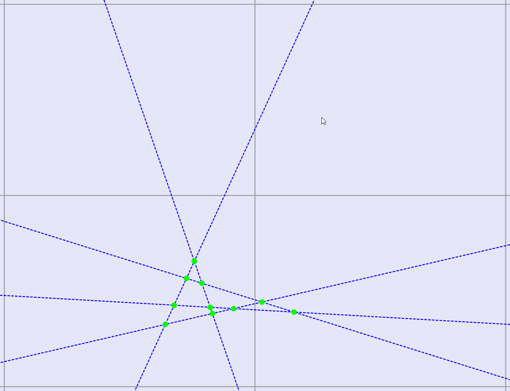
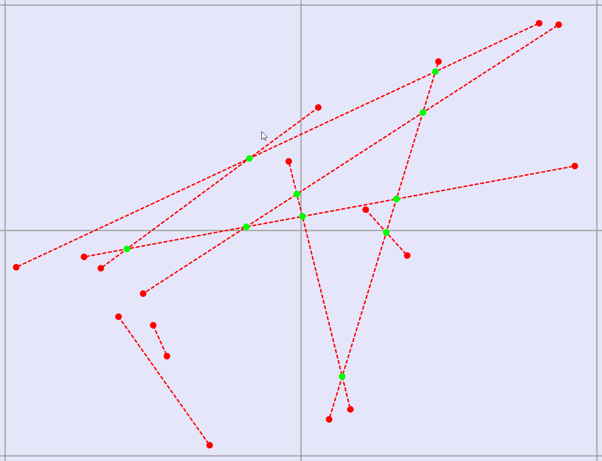
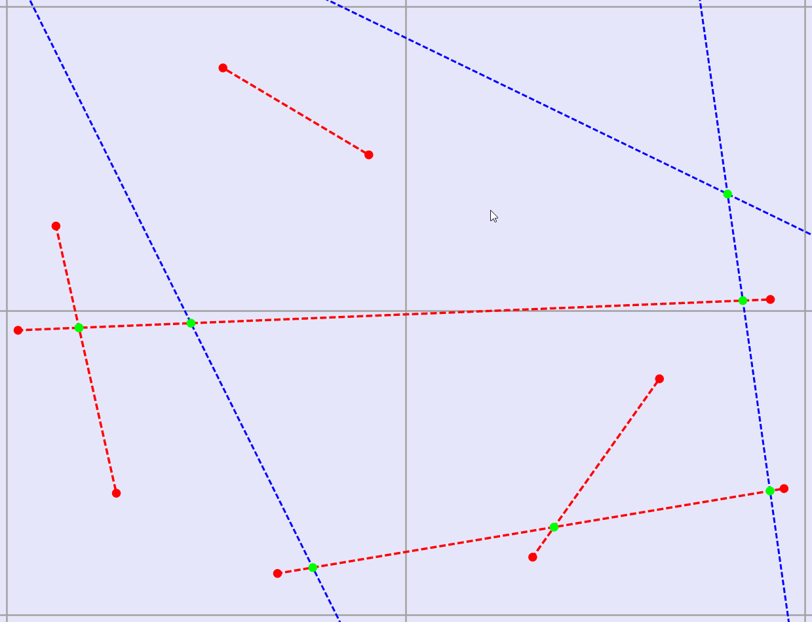
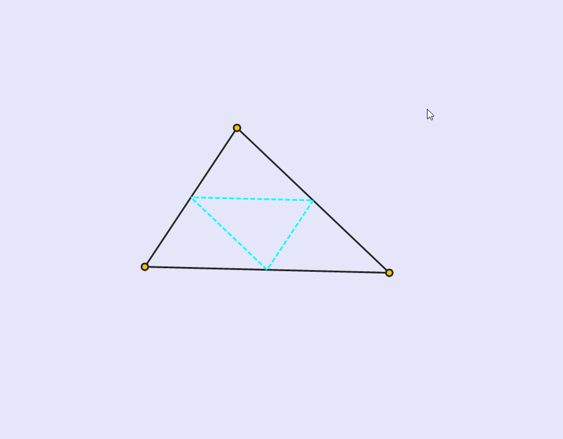
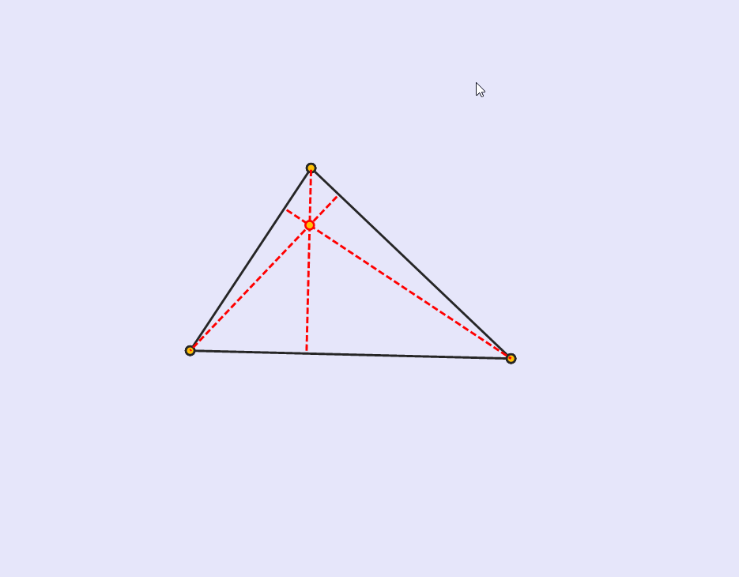
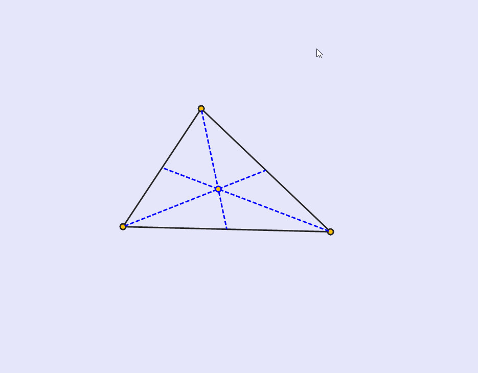
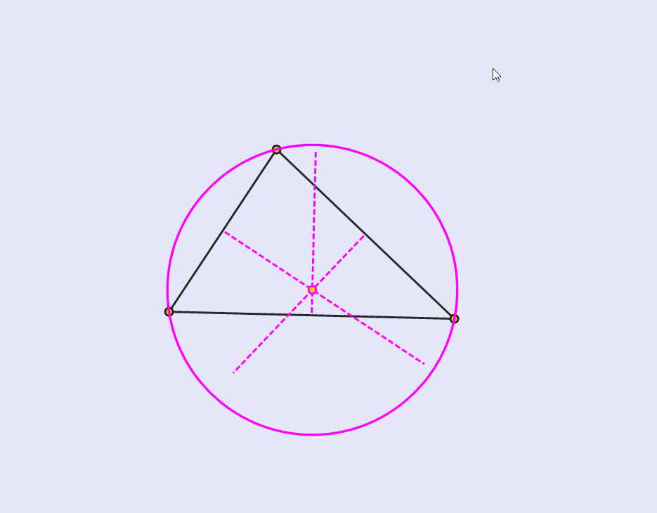
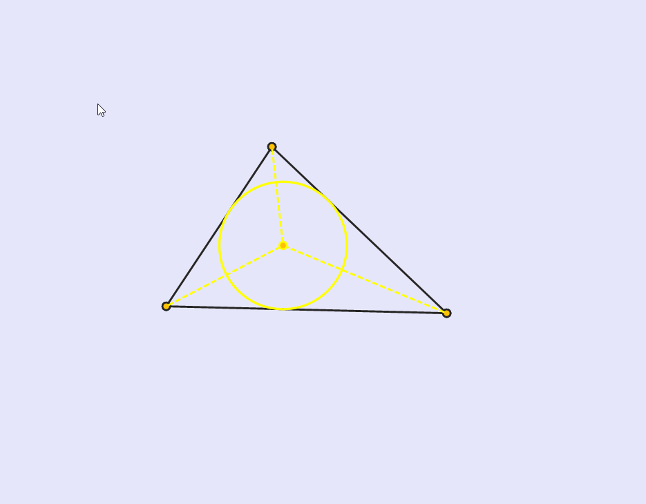

# wfa-euclid

I made this as an extra for a class I had in college, Computational Geometry, unfortunately I lost the original project and all I have are the core files. In essence is some kind of library, for `Windows Form Applications` in `C#` related to `2D Geometry`. It has:
 - [Vector](https://github.com/space-hound/wfa-euclid/blob/master/v2/model/VectorC.cs)
 - [Point](https://github.com/space-hound/wfa-euclid/blob/master/v2/model/PointC.cs)
 - [Line](https://github.com/space-hound/wfa-euclid/blob/master/v2/model/LineC.cs)
 - [Segment](https://github.com/space-hound/wfa-euclid/blob/master/v2/model/SegmentC.cs)
 -  [Rectangle](https://github.com/space-hound/wfa-euclid/blob/master/v2/model/RectangleC.cs)
 - [Triangle](https://github.com/space-hound/wfa-euclid/blob/master/v2/model/TriangleC.cs)
 - [Ellipse (& Circle)](https://github.com/space-hound/wfa-euclid/blob/master/v2/model/EllipseC.cs)

It can draw all those geometric figures, can find distances, calculate areas, or perimeters, detect intersections, parallels or perpendiculars, generate random figures, find and draw important lines in the triangle, calculate the angles and so on. 

It also can perform these transformations, on each figure:
 - Translate
 - Scale
 - Rotate 
 - Reflect
 - Shear

I made use of this book: [Geometry For Computer Graphics](https://www.math.uni.lodz.pl//~maczar/ggk/Vince%20-%20Geometry%20for%20Computer%20Graphics.pdf).

### some pictures from the old project: 

 

  
  

  
  

  
  

  
  

